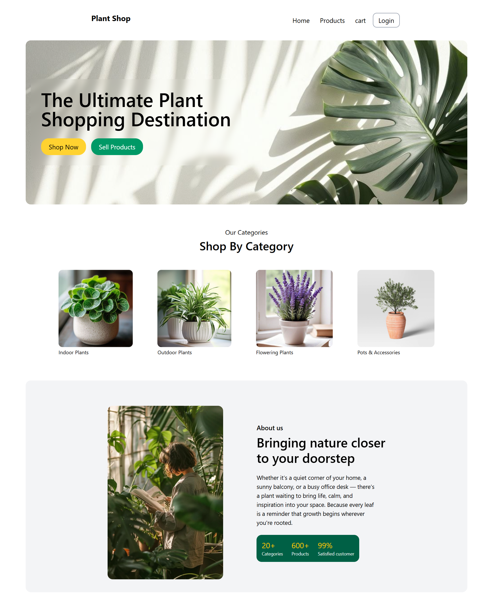
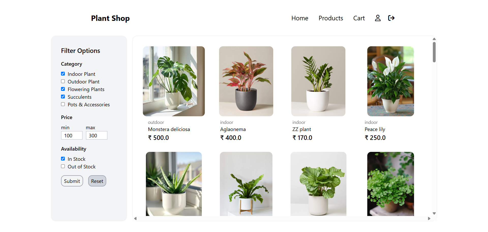
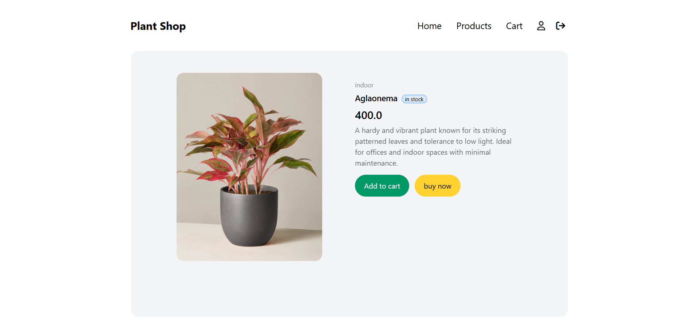
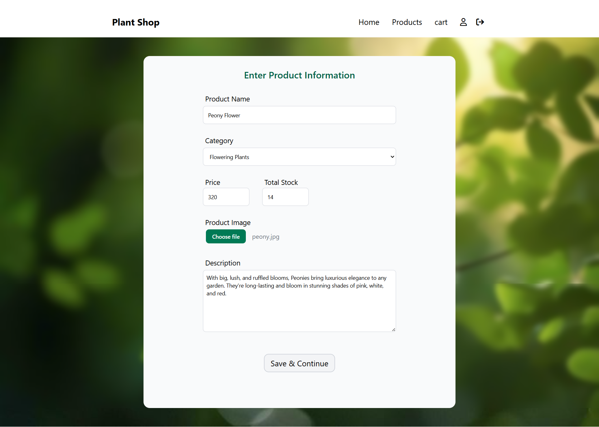
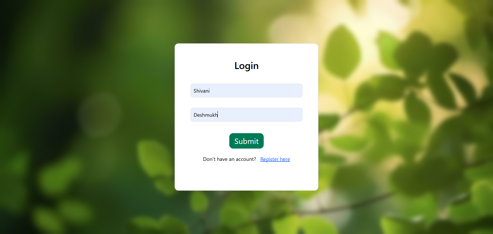
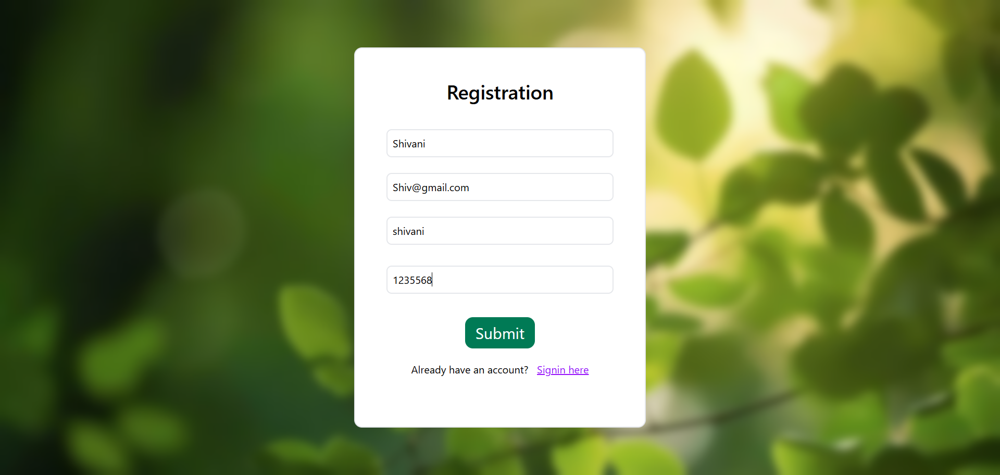

# Plant Shop - Java Web Application
**Plant Shop** is a simple e-commerce web application that allows users to explore and buy various types of plants. It is built using **Java Servlets**, **JSP**, and **MySQL**.

This project follows the **MVC architecture** and is designed as a full-stack Java web app.

---

## Screenshots

###  Home Page

###  Product Listing

### Specific Products

### Product Form

### Profile
.png)

### My Products
.png)

### Login Page

### Product Registration

